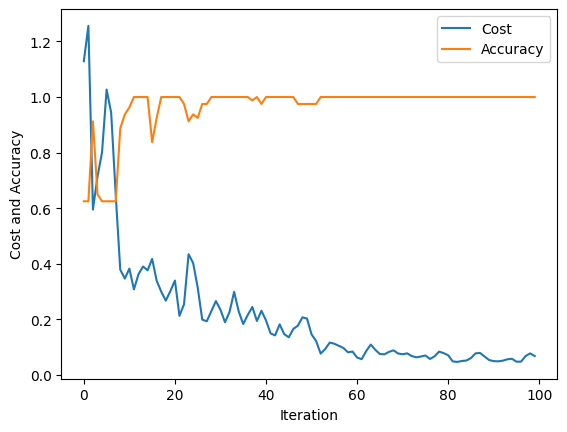

# QML

This repository contains my explorations into the vast world of Quantum Machine Learning (QML). Within each directory is a small encapsulation of an implementation of an idea or concept within QML that I learned about. Each will contain some code and a description in the form of an `.md` file. 

## Data Encoder

The data encoder explores ways of encoding classical data, like an $N$-dimensional sample $x$, into a quantum circuit. There are many ways to do this, but the ones featured here are Angle Encoding via rotation gates and Amplitude Encoding via multi-controlled $R_Y$ gates.

## Iris Variational Quantum Algorithm

This project explores the application of a VQA on classifying between two species of the Iris dataset. We used our Angle Encoding function from `data-encoder` to encode the states, and used `AdamOptimizer` to facilitate the learning. Initial tests gave the following plot of cost and accuracy over the **training** data:



## Nonlinear Activations

This project contains notes on a section of Supervised Machine Learning with Quantum Computers regarding implementing nonlinear activation functions on a quantum computer. See the `README.md` for details.


## Single Qubit Parametrized Circuit Training

A parametrized circuit is one that takes one or more parameters in its definition, usually in the form of angles of rotation gates. This project explores the most simple parametrized circuit, composed of a single rotation gate. Using gradient descent of the expectation value of the Pauli Z operator, we "train" the rotation gate to bring any state $\ket{\psi}$ into the $\ket{1}$ state by adjusting the value of $\theta$ in the rotation.


## tree

```
qml
├── data-encoder
├── iris-vqa
├── nonlinear-activations
└── single-qubit-pc-training
```